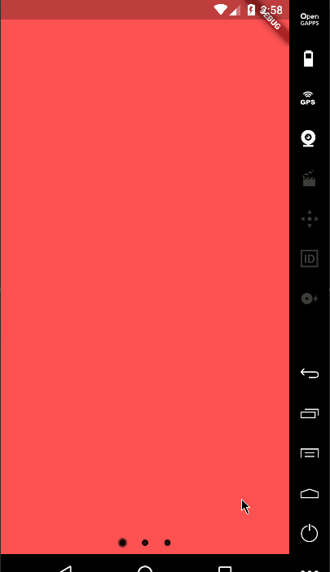
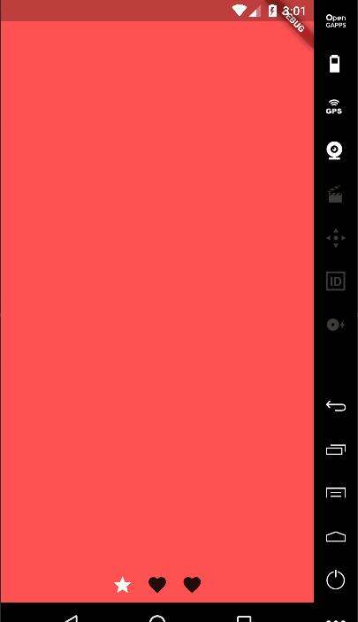

# PageViewIndicator [](https://pub.dartlang.org/packages/page_view_indicator)
Builds indication marks for PageView.

## Import
```dart
import 'package:page_view_indicator/page_view_indicator.dart';
```

## Usage

### Default Material behavior
```dart
return PageViewIndicator(
  pageIndexNotifier: pageIndexNotifier,
  length: length,
  normalBuilder: (animationController, index) => Circle(
        size: 8.0,
        color: Colors.black87,
      ),
  highlightedBuilder: (animationController, index) => ScaleTransition(
        scale: CurvedAnimation(
          parent: animationController,
          curve: Curves.ease,
        ),
        child: Circle(
          size: 12.0,
          color: Colors.black45,
        ),
      ),
);
```


---

### Custom animations
```dart
return PageViewIndicator(
  pageIndexNotifier: pageIndexNotifier,
  length: length,
  normalBuilder: (animationController, index) => Circle(
        size: 8.0,
        color: Colors.black87,
      ),
  highlightedBuilder: (animationController, index) => ScaleTransition(
        scale: CurvedAnimation(
          parent: animationController,
          curve: Curves.ease,
        ),
        child: Circle(
          size: 8.0,
          color: Colors.white,
        ),
      ),
);
```


---

### Custom icons
It's not just about dots!
```dart
return PageViewIndicator(
  pageIndexNotifier: pageIndexNotifier,
  length: length,
  normalBuilder: (animationController, index) => ScaleTransition(
        scale: CurvedAnimation(
          parent: animationController,
          curve: Curves.ease,
        ),
        child: Icon(
          Icons.favorite,
          color: Colors.black87,
        ),
      ),
  highlightedBuilder: (animationController, index) => ScaleTransition(
        scale: CurvedAnimation(
          parent: animationController,
          curve: Curves.ease,
        ),
        child: Icon(
          Icons.star,
          color: Colors.white,
        ),
      ),
);
```


### Changing the space bettwen the indicators

You can change the padding around the indicators using the `indicatorPadding` property:

```dart
return PageViewIndicator(
  pageIndexNotifier: pageIndexNotifier,
  length: length,
  indicatorPadding: const EdgeInsets.all(4.0)
  ...
```

Default is `const EdgeInsets.all(8.0)`.
